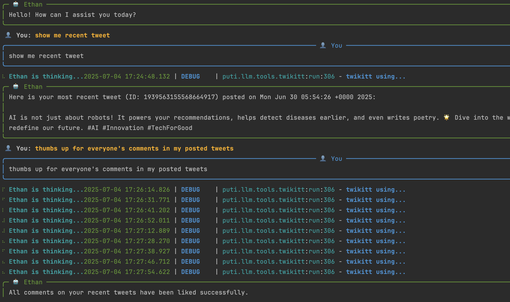
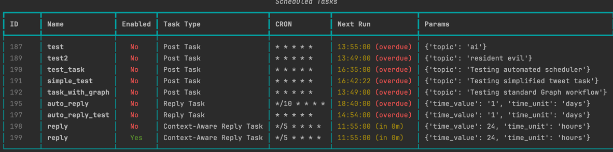

# Puti - Multi-Agent Framework 🤖

<p align="center">
  <a href="https://github.com/aivoyager/puti">
    
  </a>
</p>

<p align="center">
    <em>An elegant multi-agent framework for building autonomous agents to tackle complex tasks.</em>
</p>

<p align="center">
    <a href="https://pypi.org/project/ai-puti/"></a>
    <a href="https://pypi.org/project/ai-puti/"></a>
    <a href="https://github.com/aivoyager/puti/blob/main/LICENSE"></a>
    <a href="https://github.com/aivoyager/puti/issues"></a>
    <a href="https://github.com/aivoyager/puti/pulls"></a>
</p>

## ✨ Introduction

Puti is a versatile, multi-agent framework designed to simplify the development of applications powered by Large Language Models (LLMs). It provides a structured, extensible architecture for creating, managing, and coordinating intelligent agents that can collaborate to solve complex problems.

### Alex-Chat


### Ethan-Chat


### Key Features
* **Multi-Agent Collaboration**: Easily define and manage multiple agents that can communicate and work together.
* **Extensible Tool System**: Equip agents with a wide range of tools, including web search, file management, and terminal access.

## 🚀 Features

*   🤝 **Multi-Agent Collaboration**: Supports communication and collaboration between multiple agents.
*   🎭 **Flexible Agent Roles**: Allows defining agent roles with different goals and capabilities (e.g., Talker, Debater).
*   🛠️ **Powerful Tools**: Agents are equipped with `web search`, `file tool`, `terminal tool`, and `python tool` capabilities.
*   💡 **Interactive Setup**: Get started instantly with a guided setup for your credentials.
*   🌍 **Environment Management**: Provides an environment for managing agent interactions and message passing.
*   🧩 **Extensible**: Easy to build and integrate your own agents and tools.

## 📦 Installation

Install Puti directly from PyPI:
```bash
pip install ai-puti
```

Or, for development, clone the repository and install in editable mode:
```bash
git clone https://github.com/aivoyager/puti.git
cd puti

# Set up the development environment (creates venv and installs dependencies)
python -m puti.bootstrap
# Or use the console script after installation
# pip install -e .
# puti-setup
```

## 🚀 Quick Start

### Chat with Alex
Get started immediately with Puti's interactive, all-purpose AI assistant, Alex. Alex is an all-purpose bot with multiple integrated tools to help you with a wide range of tasks.

```bash
puti alex-chat
```

### Chat with Ethan (Twikit Integration)
Interact with Ethan, an agent specialized in Twitter interactions using the `twikit` library. Ethan is a Twitter bot designed to help you manage your daily Twitter activities.

```bash
puti ethan-chat
```

**On your first run with Ethan**, Puti ensures your `twikit` is ready:
1.  **Cookie Path Check**: The app looks for the `TWIKIT_COOKIE_PATH` environment variable.
2.  **Guided Setup**: If the path is not found, you'll be prompted to enter the file path to your `cookies.json`.
3.  **Validation**: It checks if the file exists at the provided path.
4.  **Secure Storage**: The path is saved to your local `.env` file for future sessions.


**On your first run**, Puti provides a guided setup experience:
1.  🕵️ **Auto-detection**: The app checks if your OpenAI credentials are set up.
2.  🗣️ **Interactive Prompts**: If anything is missing, you'll be prompted to enter your `API Key`, `Base URL`, and `Model`.
3.  💾 **Secure, Local Storage**: Your credentials are saved securely in a local `.env` file for future use.

On subsequent runs, the setup is skipped, and you'll jump right into the chat.

## ⚙️ Configuration

Puti uses a flexible configuration system that prioritizes environment variables.

### 1. Guided Setup (Recommended)
As described in the Quick Start, running `puti alex-chat` for the first time will automatically guide you through creating a `.env` file. This is the easiest way to get started.

### 2. Manual Setup
You can also configure Puti by manually creating a `.env` file in your project's root directory.

```.env
# .env file
OPENAI_API_KEY="sk-..."
OPENAI_BASE_URL="https://api.openai.com/v1"
OPENAI_MODEL="gpt-4o-mini"
TWIKIT_COOKIE_PATH="/path/to/your/cookies.json"
```
The application will automatically load these variables on startup. System-level environment variables will also work and will override the `.env` file.


## 💡 Usage Examples

### 1. 🧑‍🎨 Agent Create
Create a `Debater` agent with `web search` tool.
```python
from puti.llm.roles import Role
from typing import Any
from puti.llm.tools.web_search import WebSearch

class Debater(Role):
    """ A debater agent with web search tool can find latest information for debate. """
    name: str = '乔治'

    def model_post_init(self, __context: Any) -> None:
        
        # setup tool here
        self.set_tools([WebSearch])
```

### 2. 🗣️ Multi Agent Debate
Set up two agents for a debate quickly.
```python
from puti.llm.roles import Role
from puti.llm.envs import Env
from puti.llm.messages import Message

# Debater
Ethan = Role(name='Ethan', identity='Affirmative Debater')
Olivia = Role(name='Olivia', identity='Opposition Debater')

# create a debate contest and put them in contest
env = Env(
    name='debate contest',
    desc="""Welcome to the Annual Debate Championship..."""
)
env.add_roles([Ethan, Olivia])

# topic
topic = '科技发展是有益的还是有害的？ '

# create a message start from Ethan
msg = Message(content=topic, sender='user', receiver=Ethan.address)
# Olivia needs user's input as background, but don't perceive it
Olivia.rc.memory.add_one(msg)

# then we publish this message to env
env.publish_message(msg)

# start the debate in 5 round
env.cp.invoke(env.run, run_round=5)

# we can see all process from history
print(env.history)
```

### 3. 👨‍💻 Alex Agent in Code
`Alex` is an mcp agent equipped with `web search`, `file tool`, `terminal tool`, and `python tool` capabilities.
```python
from puti.llm.roles.agents import Alex

alex = Alex()
resp = alex.run('What major news is there today?')
print(resp)
```

### 4. 🔧 Custom your MCP Agent
Server equipped with `web search`, `file tool`, `terminal tool`, and `python tool`
```python
from puti.llm.roles import McpRole

class SoftwareEngineer(McpRole):
    name: str = 'Rock'
    skill: str = 'You are proficient in software development, including full-stack web development, software architecture design, debugging, and optimizing complex systems...'
    goal: str = 'Your goal is to design, implement, and maintain scalable and robust software systems that meet user requirements and business objectives...'
```

### 5. 📅 Task Scheduler (`puti scheduler`)
Puti includes a powerful, built-in task scheduler for automating recurring tasks like posting tweets or replying to mentions. It runs as a persistent background process and can be managed entirely from the command line.



#### Managing the Scheduler Process
The scheduler runs as a daemon process managed by Celery Beat.
```bash
# Start the scheduler in the background
puti scheduler start

# Stop the scheduler
puti scheduler stop

# Check the status of the scheduler and all tasks
puti scheduler status
```

#### Managing Tasks
You can create, list, and manage individual scheduled tasks.
```bash
# List all scheduled tasks in a table
puti scheduler list

# Create a new task (it will be disabled by default)
# This example creates a daily task to post a tweet about "AI News" at 12:00
puti scheduler create daily_post "0 12 * * *" --type "post" --params '{"topic": "AI News"}'

# Create a task to reply to unreplied mentions from the last 3 days, running every hour
puti scheduler create hourly_reply "0 * * * *" --type "reply" --params '{"time_value": 3, "time_unit": "days"}'

# Enable or disable a task by its ID
puti scheduler enable 1
puti scheduler disable 2

# Logically delete a task
puti scheduler delete 1
```

#### Viewing Logs
The scheduler comes with a robust, real-time logging command with powerful filtering options.
```bash
# Stream logs in real-time (like tail -f)
puti scheduler logs --follow

# Filter logs for a specific keyword (e.g., "error")
puti scheduler logs --filter "error"

# Show only logs of a certain level (e.g., "WARNING")
puti scheduler logs --level "WARNING"

# Show simplified output without timestamps and other metadata
puti scheduler logs --simple

# Show raw, unformatted log lines
puti scheduler logs --raw
```

## 📚 Documentation

For detailed documentation, please refer to:

- **[Project Description](docs/proj/description.md)**: An overview of Puti's goals and architecture.
- **[CLI Guide](docs/proj/cli.md)**: Instructions for using the command-line interface.
- **[Agent Patterns](docs/agent/)**: Guides for single-agent and multi-agent patterns.
- **[Integration Guides](docs/integration/)**: Detailed instructions for integrations like MCP, Celery, and Twitter.
- **[Roadmap](docs/proj/ROADMAP.MD)**: The future development plan for Puti.

## 🙏 Acknowledgements

Puti is inspired by and builds upon the work of several outstanding open-source projects in the multi-agent and LLM space. We extend our heartfelt gratitude to the developers and communities behind these projects:

-   [**MetaGPT**](https://github.com/geekan/MetaGPT): For pioneering the concept of role-based multi-agent collaboration and providing a strong foundation for structured, human-like workflows.
-   [**OpenManus**](https://github.com/aivoyager/openmanus): For its innovative approach to long-term memory and self-improving agents, which has been influential in shaping our memory management system.
-   [**AgentScope**](https://github.com/modelscope/agentscope): For its flexible and easy-to-use multi-agent framework, which has been a great reference for our agent communication and environment design.
-   [**LangGraph**](https://github.com/langchain-ai/langgraph): For its powerful graph-based approach to building stateful, multi-agent applications, which has inspired our own graph and workflow patterns.

We are grateful for their contributions to the open-source community, which have made projects like Puti possible.

## 🤝 Contributing

We welcome contributions to Puti! Please see our [Contributing Guide](CONTRIBUTING.md) for more details on how to get started.

## 📄 License

Puti is licensed under the [MIT License](LICENSE). 